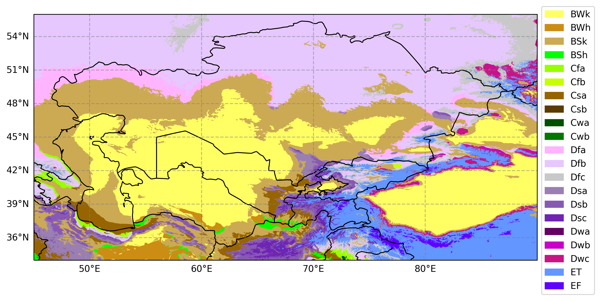

# CHELSA_KG_analysis
A program to analyze the changes of Koepen Climate categories in Central Asia using the CHELSA dataset



- I will use the kg2 based on Peel et al. 2007 , which is often recommended. It uses modern data and is widely recognized in the scientific community.
- Here is how the numbers of categoris in the input file correspond to the Köppen-Geiger classes:
    ```bash
    koppen_mapping = {
    1: "Af - Equatorial fully humid",
    2: "Am - Equatorial monsoonal",
    3: "As - Equatorial summer dry",
    4: "Aw - Equatorial winter dry",
    5: "BWk - Cold desert",
    6: "BWh - Hot desert",
    7: "BSk - Cold steppe",
    8: "BSh - Hot steppe",
    9: "Cfa - Warm temperate fully humid hot summer",
    10: "Cfb - Warm temperate fully humid warm summer",
    11: "Cfc - Warm temperate fully humid cool summer",
    12: "Csa - Warm temperate summer dry hot summer",
    13: "Csb - Warm temperate summer dry warm summer",
    14: "Csc - Warm temperate summer dry cool summer",
    15: "Cwa - Warm temperate winter dry hot summer",
    16: "Cwb - Warm temperate winter dry warm summer",
    17: "Cwc - Warm temperate winter dry cool summer",
    18: "Dfa - Snow fully humid hot summer",
    19: "Dfb - Snow fully humid warm summer",
    20: "Dfc - Snow fully humid cool summer",
    21: "Dfd - Snow fully humid extremely continental",
    22: "Dsa - Snow summer dry hot summer",
    23: "Dsb - Snow summer dry warm summer",
    24: "Dsc - Snow summer dry cool summer",
    25: "Dsd - Snow summer dry extremely continental",
    26: "Dwa - Snow winter dry hot summer",
    27: "Dwb - Snow winter dry warm summer",
    28: "Dwc - Snow winter dry cool summer",
    29: "Dwd - Snow winter dry extremely continental",
    30: "ET - Polar tundra",
    31: "EF - Polar frost"
}

  ```
- 
